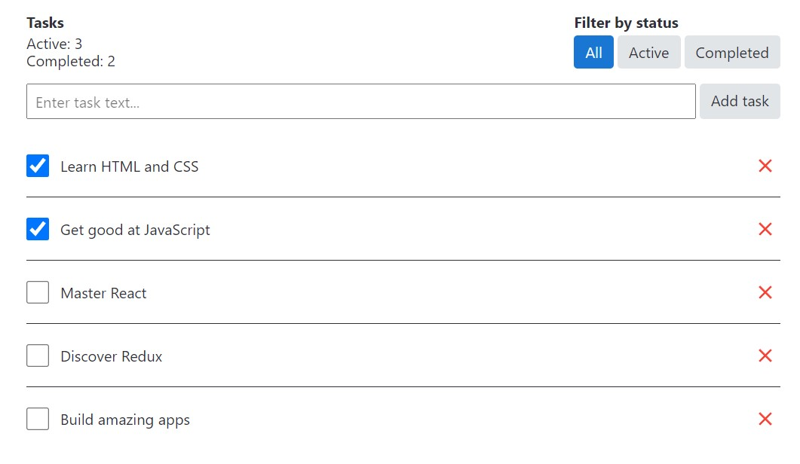

### Планувальник завдань

На прикладі простого планувальника завдань розібрано використання Redux, в якому можна створити, видалити, відзначити завдання як виконане і відфільтрувати задачі за статусом.

Базові вимоги до інтерфейсу та логіка роботи програми:

1) Інтерфейс повинен складатися з кількох частин:
- Шапка з інформацією про завдання та фільтри
- Форма з полем введення для створення нових завдань
- Список завдань
2) У шапці необхідно відображати:
- Кількість виконаних та невиконаних завдань
- Фільтри списку завдань зі значеннями «All», «Active» та «Completed»
3) У кожного елементу списку завдань має бути:
- Абзац з текстом який вводив у форму користувач під час створення завдання
- Чекбокс перемикання статусу «виконано»
- Кнопка видалення завдання

